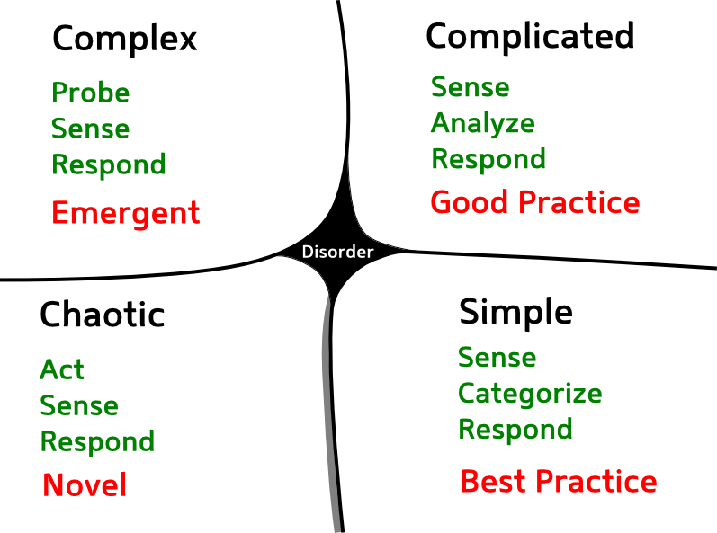

<!SLIDE bullets>
# tl;dr
Asking yourself "How will I replace this system" will help you design better
systems.

<!SLIDE center>
# We Create Systems That Are Hard To Replace

"Switching a system is very painful ... don't do it unless it is absolutely
necessary"

<!SLIDE subsection>
# Background

<!SLIDE center>
# Cynefin Framework

.notes Where is architecture. Reason about the role of the architect as the expert. Results in one way streets

<!SLIDE bullets>
# IASA Definition of Software Architecture

"The software architecture of a system is the set of structures needed to _reason
about_ the system, which comprise software elements, relations among them, and
properties of both. [1] The term also refers to documentation of a system's
software architecture. _Documenting_ software architecture facilitates
communication between _stakeholders_ , documents _early_ decisions about high-level
design, and allows _reuse_ of design components and patterns between projects"

<!SLIDE bullets>
# Ivory Tower Architecure
* Early
* Outside development
* Boxes and arrows
* Sets out to limit choices
* Component design

.notes Supposedly noone talked about architecture until the eighties, OO Multitiered started it, more complex applications

<!SLIDE subsection>
# What Traditional Architecture Focus On

<!SLIDE bullets>
# Reuse
* Tools
* Libraries
* Frameworks

.notes Spring. Reuse of business logic doesn't work

<!SLIDE bullets>
# Maintainability
* Resource availability
* What if people quit?
* Standards

<!SLIDE  bullets>
#Stakeholder
* Sueability
* Demoability
* Statsability
* Free golf rounds

<!SLIDE subsection>
# And the result is ...

<!SLIDE  bullets>
# Platforms!

.notes You need another platform to get off, or a rescue boat

<!SLIDE center>
# Cobol

Of course everybody is migrating from this

<!SLIDE center>
# Java

Because adapting a new platform can't be wrong

<!SLIDE bullets>
# Vendor Platforms 

You know who

.notes No, I don't have permission to use this image.

<!SLIDE center>
#Platforms Are One Way, Dead End Streets

.notes How will you migrate away from it?

