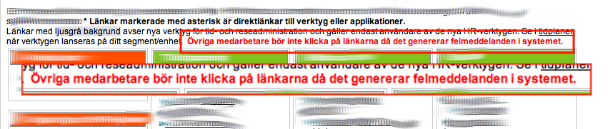

<!SLIDE bullets>
# tl;dr
Asking yourself "How will I replace this system" will help you design better
systems.

<!SLIDE center>
# We Create Systems That Are Hard To Replace

"Switching a system is very painful ... don't do it unless it is absolutely
necessary"

<!SLIDE center>
# ... Really Hard To Replace ...

<!SLIDE center>
# ... To The Point We Hate Them

<!SLIDE bullets>
#What Do We Mean By Architecture?

[Fab picture of wife]

<!SLIDE bullets>

# IASA mentions IT Architects

* Enterprise
* Infrastructure
* Information
* Business
* Software

<!SLIDE bullets>
# Ilities
* Extensibility
* Reliability
* Maintainability
* Availability
* Security

<!SLIDE bullets>

"The software architecture of a system is the set of structures needed to _reason
about_ the system, which comprise software elements, relations among them, and
properties of both. [1] The term also refers to documentation of a system's
software architecture. _Documenting_ software architecture facilitates
communication between _stakeholders_ , documents _early_ decisions about high-level
design, and allows _reuse_ of design components and patterns between projects"

<!SLIDE bullets>
# Ivory Tower 
* Early
* Outside Development
* UML
* Limits choices
* Component design

.Supposedly noone talked about architecture until the eighties, OO
Multitiered started it, more complex applications

<!SLIDE bullets>
# Reuse
* Libraries
* Spring

<!SLIDE bullets>
# Resource availablity
* What if people quit?
* Standards

<!SLIDE  bullets>
#Stakeholder
* Sueability
* Demoability
* Statsability
* Free golf rounds

<!SLIDE  bullets>
# Platforms
foto på kantrad oljeplattform

<!SLIDE center>
# Cobol

<!SLIDE center>
# Java

<!SLIDE bullets>
# .Net

<!SLIDE center>
# What We're Afraid Of

.The manufacturing problem

<!SLIDE center>
# Cynefin Framework

.Where is architecture. Reason about the role of the architect as the expert

