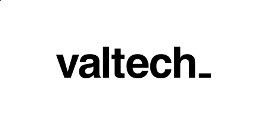

<!SLIDE center>

#[Agile Architecture - Design For Replaceability](http://marcusahnve.org/agile_architecture_presentation)

## Marcus Ahnve
[http://marcusahnve.org](http://marcusahnve.org)  
[marcus.ahnve@valtech.se](mailto:marcus.ahnve@valtech.se)  
[marcus@ahnve.com](mailto:marcus@ahnve.com)  
[@mahnve](http://www.twitter.com/mahnve)  

[http://www.valtech.se](http://www.valtech.se)

!SLIDE bullets

# About me 

* Playing Agile Coach
* Developed software professionally since 1996
* Rubyist
