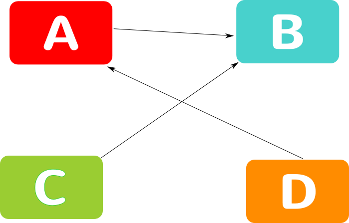
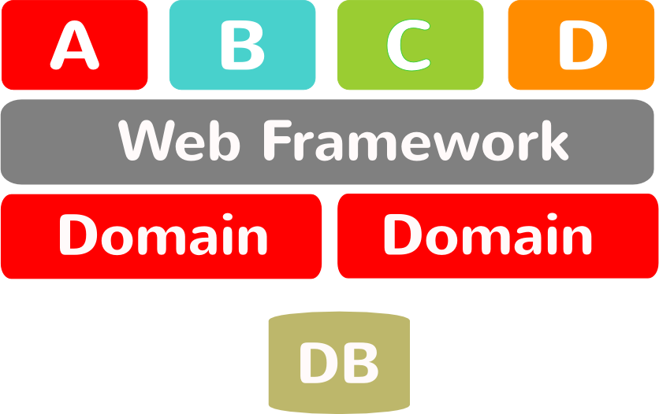
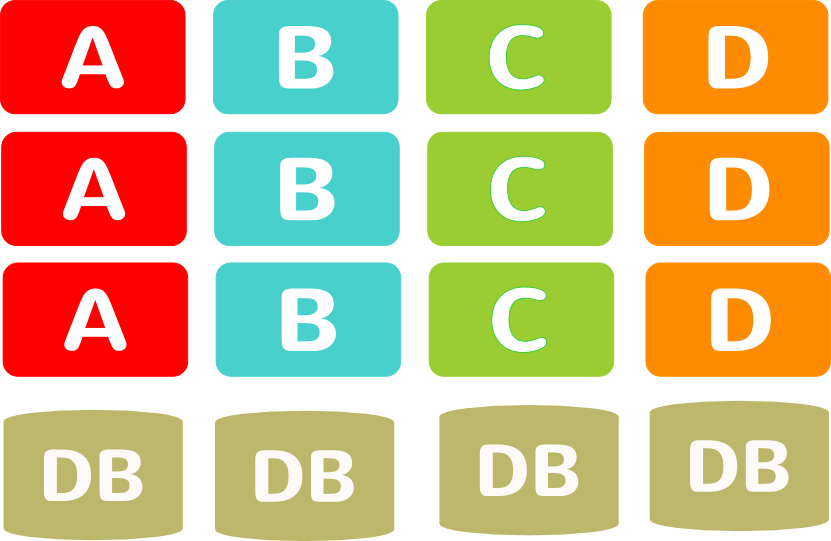
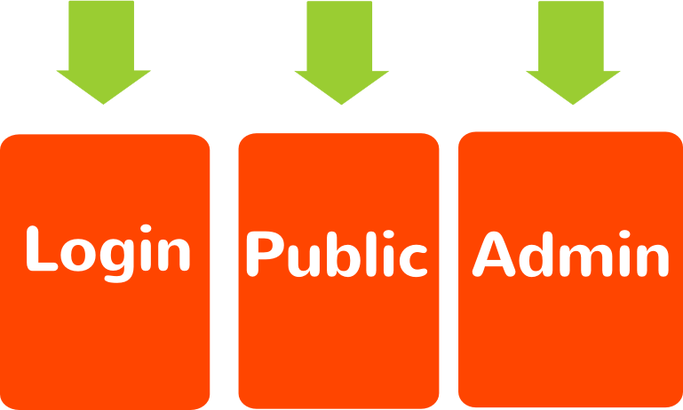
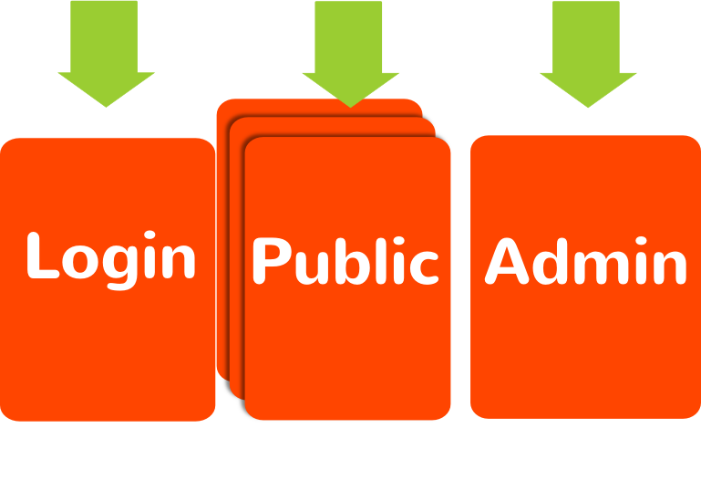
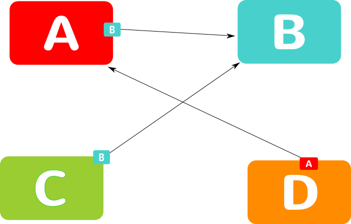
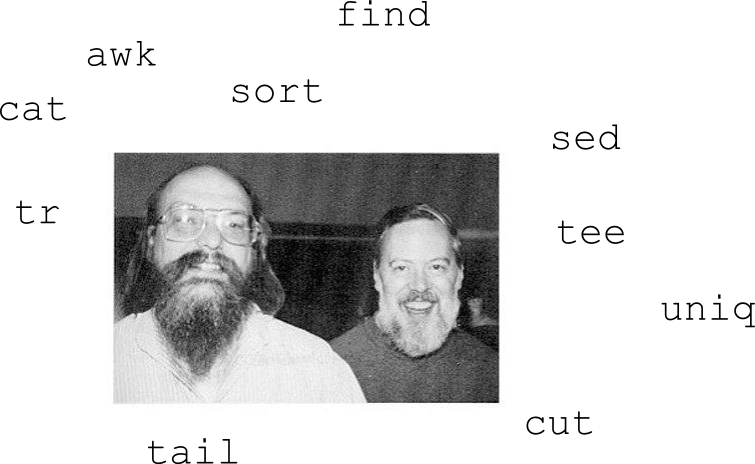

<!SLIDE subsection>
# OK, now what?

.notes This is the part of the presentation where we ask ourselves ok, so what
should we do?

<!SLIDE bullets>
# Standardize on:
* Protocol
* Data
* Never Implementation

.notes you might have the same implementation, but dont stdze!

<!SLIDE center>
#Example

<!SLIDE center>
#Section

<!SLIDE center>
#Split Section

.notes we don't really need to know the internals

<!SLIDE center>
#But The Building Blocks Are Too Big

.notes How can we replace it?

<!SLIDE center>
#Smaller Parts

<!SLIDE center>
# OAuth

notes. Adding apps as we go. No need for Oauth to know which apps.

<!SLIDE subsection>
# Other benefits

<!SLIDE center>
# Releasability

<!SLIDE center>
#Short Term Replacability - Releasability

<!SLIDE center>
#Scalability

<!SLIDE center>
#SOAP

<!SLIDE bullets>
# SOAP
* Separated in organization
* Technically joined at the hip

<!SLIDE subsection>
# Summing up

<!SLIDE bullets>
# XP's values
* Communication
* Courage
* Feedback
* _Simplicity_

We're only talking simplicity in applications

<!SLIDE center>
# UNIX always did it right

<!SLIDE center>
# A complex system that works is invariably found to have evolved from a simple system that works.

