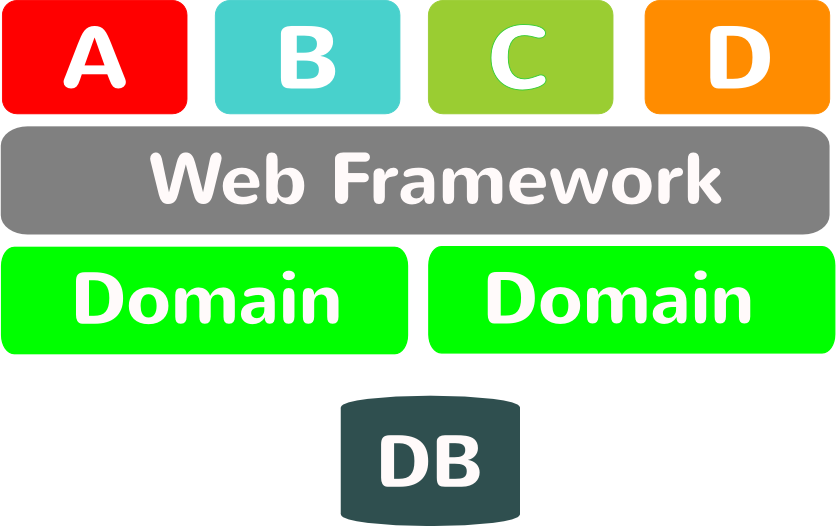

<!SLIDE bullets>
# OK, now what?

.notes This is the part of the presentation where we ask ourselves ok, so what
should we do?

<!SLIDE bullets>
# Standardize on:
* Protocol
* Data
* Never Implementation

.notes you might have the same implementation

<!SLIDE center>
#Example

<!SLIDE center>
#Section

<!SLIDE center>
#Split Section

<!SLIDE center>
#But The Building Blocks Are Too Big

.notes How can we replace it?

<!SLIDE center>
#Smaller Parts

<!SLIDE center>
# OAuth

<!SLIDE subsection>
# Other benefits

<!SLIDE center>
# Releasability

<!SLIDE center>
#Releasability

<!SLIDE center>
#Scalability

<!SLIDE bullets>
# External
* SOAP
* Generated stubs

<!SLIDE center>
#SOAP

<!SLIDE bullets>
* We're only talking simplicity in applications

<!SLIDE bullets>
# Simplicity
* Same app
* Differs in URL

<!SLIDE bullets>
# Problems
* Skala - admin på alla?

<!SLIDE bullets>
# Layer Vertically Instead of Horizontally

<!SLIDE bullets>
# Can be done differently
* Shared database
* Shared API
* [Rails experience]

<!SLIDE bullets>
# Interesting problems
* Single signon?
* OAuth?

<!SLIDE bullets>
# Conclusions
* Standardize on protocols and data, not platform

<!SLIDE bullets>
# A complex system that works is invariably found to have evolved from a simple system that works.

<!SLIDE bullets>
# UNIX always did it right
* [bild på Ken Thompson och Dennis Ritchie]

<!SLIDE bullets>
# How Will You Replace It?

